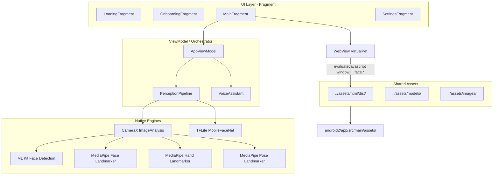
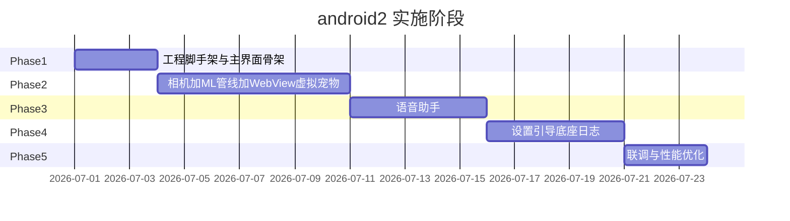

# Android2 原生 Android 迁移计划

## 目标与约束


| 项            | 决策                                                                                                                                    |
| ------------ | ------------------------------------------------------------------------------------------------------------------------------------- |
| 工程位置         | 新建 `[android2/](android2/)`，独立 Gradle 工程，可单独用 Android Studio 打开/编译                                                                    |
| UI 技术栈       | **Java + View/XML + Fragment**（非 Compose，不使用 Kotlin）                                                                                  |
| 语言版本         | **Java 17**（与 Android Gradle Plugin 8.x 兼容）                                                                                           |
| 与 Flutter 关系 | **完全独立**；`[android/](android/)` 与 `[lib/](lib/)` **不修改**                                                                              |
| 去掉的功能        | 物体识别（YOLO）、手持物体融合、相关 UI 开关与感知字段                                                                                                       |
| 保留的功能        | 人脸表情、手势、身份识别、虚拟宠物 WebView、语音助手、底座蓝牙、设置/引导/日志                                                                                          |
| **改进原则**     | **功能行为一致**，但允许修正 Flutter 版架构不合理或性能低下的实现；阈值/算法逻辑沿用 `[lib/core/app_tuning.dart](lib/core/app_tuning.dart)` 与现有 FSM 规则，除非优化有明确收益且不影响用户体验 |


---

## 整体架构




核心编排逻辑对标 Flutter 的 `[lib/core/app_controller.dart](lib/core/app_controller.dart)`（~1700 行），拆分为 Java 的 `AppViewModel` + 若干专用 Manager，避免单类过大。异步与线程模型使用 `ExecutorService` / `HandlerThread` + `LiveData`/`Callback`（不引入 Kotlin 协程）。

---

## 相对 Flutter 的可改进点

> 以下改进**不改变对外功能**（同样的设置项、同样的虚拟宠物行为、同样的语音/感知协议），仅优化内部实现。Flutter 版痛点主要来自：Dart isolate 与 Platform Channel 开销、WebView Hybrid Composition 与相机抢主线程、1700 行单体 Controller 等。

### 1. 相机采样：从「脉冲式 3.3fps」升级为持续后台分析

**Flutter 现状**（`[app_controller.dart:240-252](lib/core/app_controller.dart)`）：因 `webview_flutter` Hybrid Composition 与 `startImageStream` 同抢 Android 主线程，被迫用 Timer 每隔 300ms 临时开流抓一帧后立即 `stopImageStream`，有效采样率仅 ~3.3fps，靠 JS spring 平滑补偿。

**android2 改进**：

- CameraX `ImageAnalysis` 默认在**后台 Executor** 收帧，与 WebView 渲染线程分离，无需脉冲式开/停流
- 分析链路目标 **8~12fps**（仍保留 `[AppTuning](lib/core/app_tuning.dart)` 中身份识别 1.2s 节流、日志 2s 节流等业务节流，但注视/表情刷新更跟手）
- Preview 与 Analysis **分流**：Preview 全分辨率，Analysis 限定 ~480p（对标 Flutter `ResolutionPreset.medium`），降低 ML 负载

### 2. 图像转换：跳过不必要的 YUV→RGBA 全量转换

**Flutter 现状**（`[camera_image_utils.dart](lib/services/camera_image_utils.dart)`）：每帧 `Isolate.run` 做逐像素 YUV→RGB + 旋转 + `getBytes`，medium 分辨率下单帧数十毫秒。

**android2 改进**：

- 优先让 MediaPipe Tasks / ML Kit **直接消费 NV21/YUV_420_888**（官方 API 支持），仅在身份识别裁剪/录入时才转 RGB
- 复用 `byte[]` / `ImageProxy` 缓冲池，避免每帧 new 大数组
- 去掉物体识别后，**不再需要 JPEG 编码**（Flutter 版 YOLO 路径的额外开销）

### 3. 感知管线：专用线程池 + 并行推理

**Flutter 现状**：多个 `Future` 并发但仍在 Dart 事件循环调度，且每帧 `notifyListeners()` 触发整棵 UI 树重建（`[app_controller.dart](lib/core/app_controller.dart)` 中 26 处通知）。

**android2 改进**：

- 固定大小 `ExecutorService`（如 2~3 线程）并行跑 Face / Hand / MLKit / Identity
- **细粒度 LiveData**：`GazeLiveData`、`ExpressionLiveData`、`VoiceStateLiveData` 等分开发布，Fragment 只 observe 所需字段，避免整页刷新
- 帧处理结果用 `volatile` 引用或环形缓冲传递，UI 层仍保持 ~20fps JS 推送节流

### 4. WebView 虚拟宠物：更轻量的资源加载

**Flutter 现状**（`[static_server.dart](lib/services/static_server.dart)`）：每次启动删除临时目录、从 AssetBundle **全量复制** html/dist 再启 NanoHTTPD；双击需透明 Flutter 层覆盖 WebView 才能捕获手势。

**android2 改进**：

- 优先 **WebViewAssetLoader** 直接映射 assets（省去复制 + HTTP 服务）；若 Vite 相对路径不兼容再回退 NanoHTTPD
- HTML 资源**首次复制后按版本号缓存**（SharedPreferences 存 hash），升级时才重新解压
- 双击手势用原生 `GestureDetector` / `OnTouchListener` 叠层，无需 Platform View 变通
- JS Bridge 仍用 `evaluateJavascript` 推送 `window.__face.`*（与 React 端契约不变），合并调用 + 50ms 节流保留

### 5. 架构拆分：模块化替代单体 Controller

**Flutter 现状**：`AppController` ~1700 行，混合相机、ML、语音、底座、日志、引导等全部职责。

**android2 改进**（包结构更清晰，功能等价）：


| Java 模块                       | 职责                      |
| ----------------------------- | ----------------------- |
| `PerceptionPipeline`          | 相机帧调度 + ML 引擎编排         |
| `EmotionController`           | 表情→FSM 映射 + 行为/活动追踪     |
| `VoiceAssistant`              | 语音 FSM（独立类，状态 enum 显式化） |
| `BaseService`                 | 蓝牙 SPP                  |
| `PersonaLogger` + `LogServer` | 日志持久化 + HTTP 浏览         |
| `AppViewModel`                | 仅做模块间协调与生命周期            |


### 6. 数据层：Room 替代 JSON 文件

**Flutter 现状**：人物库等用 JSON 文件读写（`[person_repository.dart](lib/services/person_repository.dart)`）。

**android2 改进**：Room DB 存 Person + embedding BLOB，查询/去重更高效；对外 API（录入/识别/删除）行为不变。

### 7. 其他可保留或微调项


| 项                     | 决策                                                                         |
| --------------------- | -------------------------------------------------------------------------- |
| ML Kit + MediaPipe 双跑 | **保留**（Flutter 版 MLKit 管多脸框排序，MediaPipe 管 478 点/表情，职责不同）                   |
| 身份 slot 追踪            | **保留**算法（`[AppTuning.slotMatchDistance](lib/core/app_tuning.dart)` = 0.15） |
| 注视触发 8s + 60s 冷却      | **保留**阈值，行为一致                                                              |
| barge-in 默认关闭         | **保留**（Flutter 版因回声自激默认关）                                                  |
| 阈值常量                  | 默认沿用 `AppTuning` 编译期常量；后续可选迁入 SharedPreferences 做运行时调参（非必须）                |


---

## 工程脚手架（Phase 1）

### 1.1 目录结构

```
android2/
├── settings.gradle
├── build.gradle
├── gradle.properties
├── gradle/wrapper/
└── app/
    ├── build.gradle
    └── src/main/
        ├── AndroidManifest.xml
        ├── java/com/xbot/xbot/
        │   ├── XBotApplication.java
        │   ├── MainActivity.java         # 横屏全屏 Single-Activity
        │   ├── ui/                       # Fragment + 自定义 View
        │   ├── viewmodel/
        │   ├── perception/               # 各 ML 引擎
        │   ├── voice/
        │   ├── base/                     # 蓝牙底座
        │   ├── data/                     # Room / SharedPreferences
        │   └── util/
        ├── res/layout/                   # XML 布局
        └── assets/                       # 从 ../assets/ 同步
```

### 1.2 Gradle 关键配置

- `applicationId`: `com.xbot.xbot.native`（与 Flutter 版区分，可同机并存；若需覆盖安装可改回 `com.xbot.xbot`）
- `minSdk 24`，`compileSdk 36`，`targetSdk 35+`
- **纯 Java 工程**：不引入 Kotlin 插件与 `kotlin-stdlib`；使用 Groovy DSL（`build.gradle`）或 Kotlin DSL 均可，但源码目录为 `src/main/java/`
- Java 17（`compileOptions` + `sourceCompatibility`）
- AndroidX：`appcompat`、`fragment`、`lifecycle-viewmodel`、`lifecycle-livedata`、`camera-`*
- **Release 关闭 R8 混淆**（与 Flutter 版一致，MediaPipe 依赖栈回溯加载原生库）
- 依赖方向（无 YOLO 后 **不再需要** `[android/app/build.gradle.kts](android/app/build.gradle.kts)` 中 LiteRT 1.4/2.1 冲突 workaround）

### 1.3 共享资源策略

在 `app/build.gradle` 增加 Gradle 同步任务，构建前将仓库根目录资源复制到 `assets/`：

- `[assets/html/dist/](assets/html/dist/)` — 虚拟宠物（需先 `cd assets/html && npm run build`）
- `[assets/models/](assets/models/)` — `mobilefacenet.tflite`、MediaPipe `.task` 模型、sherpa-onnx KWS 模型
- `[assets/images/](assets/images/)` — logo 等

> 不修改原 `android/`，仅在 `android2` 的 Gradle 中引用 `../assets/`。

### 1.4 Manifest 权限

复刻 `[android/app/src/main/AndroidManifest.xml](android/app/src/main/AndroidManifest.xml)` 中的 CAMERA、RECORD_AUDIO、INTERNET、BLUETOOTH_*、FOREGROUND_SERVICE 等声明；去掉 Flutter 专属 meta-data。

### 1.5 主界面骨架

- `MainActivity`：强制横屏、`FLAG_KEEP_SCREEN_ON`、沉浸式全屏
- `NavHost`（FragmentManager + 自定义或 Navigation Component）：
  - `LoadingFragment` → 模型/权限初始化
  - `OnboardingFragment` → 首次引导（对标 `[lib/ui/onboarding/](lib/ui/onboarding/)`）
  - `MainFragment` → 虚拟宠物 / 调试模式切换
  - `SettingsFragment` 及子 Fragment

---

## 感知管线（Phase 2）

### 2.1 相机

- **CameraX** `Preview` + `ImageAnalysis`（YUV_420_888），Analysis 绑定后台 `ExecutorService`
- **持续分析**（非 Flutter 脉冲式开/停流），目标 8~12fps；Preview/Analysis 分辨率分流
- 默认前置摄像头，可在设置中切换后置
- 帧旋转/镜像逻辑移植自 `[lib/services/camera_image_utils.dart](lib/services/camera_image_utils.dart)`，但优先直传 YUV 给 ML 引擎，减少 RGB 转换

### 2.2 各引擎与 Flutter 对照


| 能力         | Flutter 实现                                                                           | android2 原生方案                                                |
| ---------- | ------------------------------------------------------------------------------------ | ------------------------------------------------------------ |
| 多脸检测       | `google_mlkit_face_detection`                                                        | **ML Kit Face Detection**（`com.google.mlkit:face-detection`） |
| 478 点 + 表情 | `kwon_mediapipe_landmarker`                                                          | **MediaPipe Tasks** `FaceLandmarker`（`.task` 模型放 assets）     |
| 人体姿态       | 同上（face+pose 同次推理）                                                                   | **MediaPipe Tasks** `PoseLandmarker`                         |
| 手势         | `hand_detection` 插件                                                                  | **MediaPipe Tasks** `HandLandmarker` + 规则手势分类                |
| 身份识别       | `flutter_litert` + MobileFaceNet                                                     | **TensorFlow Lite** Java API 直接加载 `mobilefacenet.tflite`     |
| 表情分类       | `[lib/services/expression_classifier.dart](lib/services/expression_classifier.dart)` | 逐行移植 blendshape 规则到 Java                                     |


### 2.3 帧调度

对标 `AppController._processFrame()` 的并行/节流策略（`[lib/core/app_tuning.dart](lib/core/app_tuning.dart)`），但采样率可高于 Flutter 版 300ms 脉冲：

- 人脸/手势：Analysis 持续收帧，近实时并行推理（线程池）
- 身份识别：~1.2s 节流，TTL 3s（阈值不变）
- 日志落盘：变化触发 + 2s 最小间隔（阈值不变）
- **去掉**：`objectInterval`、`_runObjectDetection`、`_markHeldObjects`、JPEG isolate 编码

### 2.4 调试覆盖层

- 自定义 `DetectionOverlayView`（Canvas 绘制），对标 `[lib/ui/overlay_painter.dart](lib/ui/overlay_painter.dart)`
- 去掉 `showObject` / 物体框绘制分支
- 调试模式：CameraX Preview + Overlay；默认模式：WebView 全屏

### 2.5 下游影响（去掉物体识别）

需调整但保持接口兼容的逻辑（发送空值即可）：

- `[lib/face/activity_state_tracker.dart](lib/face/activity_state_tracker.dart)` 中 drinking/on-phone 依赖 `heldObject` → 原生版仅保留人脸/手势启发式
- 语音感知 payload（`[lib/services/voice/pophie_client.dart](lib/services/voice/pophie_client.dart)`）中 `objects`/`held_object`/`scene` 字段传空列表或省略

---

## 虚拟宠物 WebView（Phase 2 同期）

### 3.1 静态文件服务

Flutter 用 `[lib/services/static_server.dart](lib/services/static_server.dart)` 把 assets 复制到临时目录后启本地 HTTP。原生版方案（按优先级）：

- **A. WebViewAssetLoader**（推荐）：AndroidX 直接映射 assets，零复制、零 HTTP 服务
- **B. 缓存式 NanoHTTPD**：首次解压 html/dist 到 filesDir 并按版本 hash 跳过重复复制；加载 `http://127.0.0.1:<port>/index.html?style=ambient`
- **C. 全量复制 NanoHTTPD**：仅作 A/B 不可用时的回退

### 3.2 JS Bridge

移植 `[lib/ui/camera_screen.dart](lib/ui/camera_screen.dart)` 中 `_VirtualPetWebView._pushAll()` 逻辑：

```javascript
var f = window.__face;
f.setState('gazing');           // FSM 状态
f.setGazeTarget(x, y);         // 注视 -1..1
f.setListeningLoudness(0.5);   // 语音嘴部张合
```

- 节流 ~20fps（50ms 窗口），合并多次 `evaluateJavascript` 为一次调用
- 双击手势：透明 `View` 叠在 WebView 之上捕获（解决 platform view 吞触摸的问题，与 Flutter 版相同思路）

### 3.3 情绪/行为 FSM

移植以下 Java 模块：

- `[lib/face/emotion_mapper.dart](lib/face/emotion_mapper.dart)` — 7 种表情 → FSM
- `[lib/face/behavior_state_tracker.dart](lib/face/behavior_state_tracker.dart)`
- `[lib/face/gaze_zone_detector.dart](lib/face/gaze_zone_detector.dart)` — 九宫格量化

---

## 语音助手（Phase 3）

对标 `[lib/services/voice/voice_assistant.dart](lib/services/voice/voice_assistant.dart)`（~1300 行 FSM）：


| 组件        | Flutter             | android2                                                                                   |
| --------- | ------------------- | ------------------------------------------------------------------------------------------ |
| 唤醒词       | `sherpa_onnx`       | **sherpa-onnx Android AAR**（模型已在 `assets/models/voice/`）                                   |
| 麦克风       | `record`            | `AudioRecord` + 环形缓冲                                                                       |
| 流式 STT    | WebSocket           | OkHttp WebSocket（对标 `[stt_stream_client.dart](lib/services/voice/stt_stream_client.dart)`） |
| 对话 API    | `dio` → Pophie      | OkHttp + Gson（对标 `[pophie_client.dart](lib/services/voice/pophie_client.dart)`）            |
| 流式 TTS    | `flutter_pcm_sound` | **AudioTrack**（PCM 16-bit mono，对标文档 §3.6.1）                                                |
| 批量 TTS 回退 | `audioplayers`      | MediaPlayer / ExoPlayer                                                                    |
| 拼音转换      | `lpinyin`           | Java 拼音库（如 TinyPinyin / pinyin4j）生成唤醒词 token 序列                                            |


状态机：`idle → listening → thinking → speaking`，支持双击触发、注视触发、唤醒词触发；默认关闭 barge-in（与 Flutter 版一致）。

感知上下文构建时**不含物体字段**。

---

## 数据层与设置（Phase 4）

### 4.1 持久化


| 数据             | 方案                                                                               |
| -------------- | -------------------------------------------------------------------------------- |
| 人物库（embedding） | **Room DB**（embedding 存 BLOB；比 Flutter JSON 文件更高效，功能等价）                          |
| 主人资料 / 设置开关    | SharedPreferences / DataStore                                                    |
| 人物日志           | 按天写文件（对标 `[lib/services/persona_logger.dart](lib/services/persona_logger.dart)`） |
| 网络请求日志         | 同上                                                                               |


### 4.2 设置页 Fragment

移植 `[lib/ui/settings/](lib/ui/settings/)` 下各页面，**去掉**「物体识别」「物体框」开关：

- 显示模式（调试/虚拟宠物）
- 各识别引擎开关（人脸/手势/身份/姿态）
- 语音助手配置
- 底座控制
- 人脸录入（`[face_registration_screen.dart](lib/ui/settings/face_registration_screen.dart)`）
- 日志浏览（内嵌 WebView 或 NanoHTTPD 服务，对标 `[persona_log_server.dart](lib/services/persona_log_server.dart)`）

### 4.3 首次引导

移植 `[lib/ui/onboarding/onboarding_screen.dart](lib/ui/onboarding/onboarding_screen.dart)`：昵称、机器人名、性别、生日、人脸扫描录入。

---

## 底座蓝牙控制（Phase 4）

直接基于 Android **BluetoothAdapter + BluetoothSocket (RFCOMM)** 实现，协议移植自：

- `[lib/services/base/base_service.dart](lib/services/base/base_service.dart)`
- `[lib/services/base/base_protocol.dart](lib/services/base/base_protocol.dart)`
- `[docs/底座控制协议.md](docs/底座控制协议.md)`

可参考 `[plugins/flutter_bluetooth_serial/android/](plugins/flutter_bluetooth_serial/android/)` 的 SPP 连接逻辑，但**不依赖 Flutter 插件**，在 `android2` 内自包含。

---

## 分阶段交付与验收




| 阶段            | 交付物                   | 验收标准                                                            |
| ------------- | --------------------- | --------------------------------------------------------------- |
| **P1 脚手架**    | 可编译运行的 `android2` APK | 横屏启动 → Loading → 空白主界面                                          |
| **P2 感知+宠物**  | 摄像头识别 + WebView 表情联动  | 默认虚拟宠物随人脸注视/表情变化；调试模式显示 overlay；**感知帧率应明显高于 Flutter 版 ~3.3fps** |
| **P3 语音**     | 完整语音 FSM              | 唤醒词/双击可对话，TTS 流式播放                                              |
| **P4 周边**     | 设置/引导/底座/日志           | 功能与 Flutter 版对齐（除物体识别）                                          |
| **P5 polish** | 性能与稳定性                | 30fps 感知不卡 UI；长时间运行无内存泄漏                                        |


---

## Java 实现要点

- **ViewModel + LiveData**：UI 层通过 `observe()` 订阅状态，主线程更新 Fragment；感知/语音后台任务在 `ExecutorService` 或专用 `HandlerThread` 执行
- **CameraX 回调**：`ImageAnalysis.Analyzer` 在后台线程收帧，结果通过 `Handler(Looper.getMainLooper())` 或 `LiveData.postValue()` 回传 UI
- **Room / Gson**：数据层全部用 Java POJO + 注解处理器（`annotationProcessor` 配置 Room Compiler）
- **MediaPipe / TFLite**：官方 Java API 均有对应绑定，无需 Kotlin 扩展函数
- **蓝牙 SPP**：可参考现有 `[plugins/flutter_bluetooth_serial/android/](plugins/flutter_bluetooth_serial/android/)` 中的 **Java** 实现（`BluetoothConnection.java` 等），直接移植到 `android2`

## 关键风险与应对

1. **MediaPipe 模型体积**：Face/Hand/Pose `.task` 文件需确认是否已在 assets 中或需从 Flutter 插件包提取；构建脚本应校验缺失模型并给出明确错误。
2. **HTML 产物未构建**：`assets/html/dist/` 可能不在 git 中；CI/README 需注明先执行 `npm run build`。
3. **sherpa-onnx Android 集成**：需验证 AAR 与 arm64-v8a ABI 兼容性；唤醒词中文拼音 token 转换需单独测试。
4. **WebView JS 性能**：保持 20fps 节流 + 合并 JS 调用，避免 `evaluateJavascript` 队列堆积（Flutter 版已有此问题经验）。
5. **TFLite 简化**：去掉 YOLO 后仅 MobileFaceNet 使用 TFLite，Gradle 依赖大幅简化，无需 LiteRT 双版本 workaround。
6. **Java 代码量**：Dart → Java 移植后代码行数会增多（无 data class / 协程语法糖）；建议按模块拆分 Package，保持单类职责清晰。

---

## 不在本次范围

- 修改 `[android/](android/)` 或任何 Flutter/Dart 代码
- 从 Flutter 版移除物体识别（若需要可另开任务）
- iOS 原生化
- Compose UI 迁移
- Kotlin 源码（工程为纯 Java，不混用 Kotlin）

